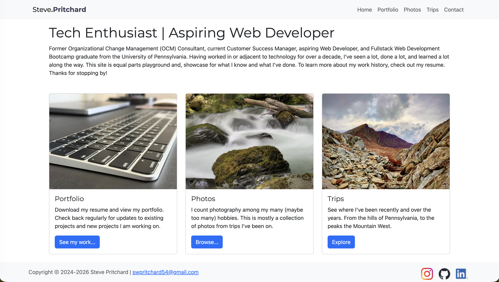

# Steve Pritchard: Tech Enthusiast | Aspiring Web Developer

## Table of Contents
[Description](#description) 
[Objectives](#objectives) 
[Technologies](#technologies) 
[Contact Me](#contact-me) 

## Description
Going back to the days of Angelfire and Geocities (IYKYK) I've always had an interest in building websites. This site is the next evolution of what I started over 20 years ago. It also expands on what I learned while enrolled in the Penn LPS Coding Boot Camp associated with the Penn Arts and Sciences Professional and Organizational Development program.

## Objectives
• Build a fully responsive site with great content utilizing modern development best practices and tools 
• Become less reliant on AI and Google Searches while developing 
• Do it entirely for free 

## Technologies
• [React](https://react.dev/) / [Vite](https://vite.dev/): Front end development 
• [Bootstrap CSS](https://getbootstrap.com/): Styling and page layout 
• [Leaflet.js](https://leafletjs.com/): Map functionality 
• [Cloudinary](https://cloudinary.com): Image serving 
• [Github](https://github.com) / [MS Visual Studio](https://code.visualstudio.com/): Code Management, Version Control, and Collaboration 
• [React Icons](https://react-icons.github.io/react-icons/): Iconography 
• [EmailJS](https://emailjs.com): Contact form functionality

## Contact Me
• [By Email](mailto:swpritchard54@gmail.com) 
• [Contact Form](https://stevepritchard.com/#/contact) 
• [LinkedIn](https://www.linkedin.com/in/swpritchard/)